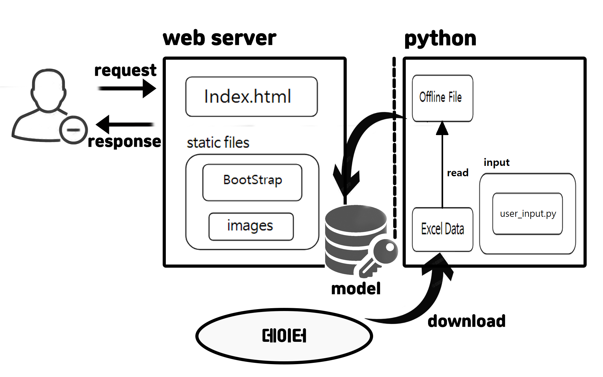
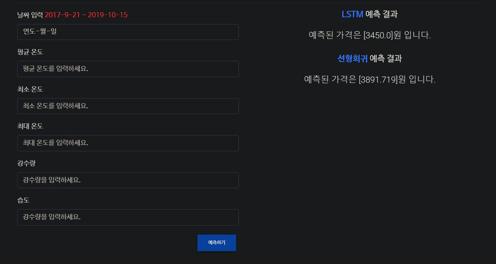

# Title
다변인 선형회귀, LSTM을 이용한 미래 가격예측

## Team member

> Contributors/People

| YoungMin Park | Juyeol Yu | Myeongjae Lee |
| :---: | :---: | :---: |
| </img> | </img>  | </img>  |
| https://github.com/pym7857 | https://github.com/yudazzi | https://github.com/DdingJae |   

- You can see team member and github profile
- You should probably find team member's lastest project

## 설계도
 

## Web Site
http://18.221.85.158:5000/ 
<br>
 

## Web Site (예측 결과)
 

## 서버 실행
```
# 깃 허브에서 소스코드를 다운로드 받습니다.
https://github.com/pym7857/pricePrediction.git

# 받은 프로젝트 폴더로 이동합니다.
cd pricePrediction

# 플라스크 웹 서버 폴더로 이동합니다.
cd "Flask Web Server"

# 웹 서버를 실행합니다.
python server.py
```

## Tensorflow 데이터 학습 모델 생성
```
# 프로젝트 폴더에서 파이썬 폴더로 이동합니다.
cd "Python Code"

# 엑셀(Excel) 파일로 학습을 수행합니다.
python offline_save.py

# (옵션) 학습된 데이터를 확인합니다.
python "user_input.py"
>> 평균 온도: -2.7
>> 최저 온도: -6.6
>> 최고 온도: 2.0
>> 강수량:  0.1
[2000.2086]

# 이후에 생성된 모델 파일을 웹 서버의 model 폴더에 붙여넣기 하면 적용됩니다.
```

## 핵심사항
```
(텐서플로우)
# offline_save.py: 다변인 선형회귀 모델 개발 & 데이터 저장 (model 폴더에 저장)
# user_input.py: 데이터 불러오기 & 사용자 입력
# Flask의 폴더는 model / static / templates로 나누어 구성 
# index.html에서 데이터 입력부분은 form 태그로 POST 방식으로 데이터 전송
# server.py: 플라스크(Flask)를 이용해 웹서버 연동 (port:5000)
```

## AWS EC2를 이용해 hosting
```
# 1. EC2 인스턴스 생성, 키 획득
# 2. 제공받은 키를 이용하여 SSH 명령어를 사용해 접속
# 3. 깃 클론을 이용해 파이썬 코드를 불러와 관리자 권한으로 실행
# 4. 서버 배포를 위해 인스턴스 보안설정에 인바운드 규칙에 포트번호 5000번을 추가
# 5. 인스턴스에서 제공하는 public IP/DNS를 통해 접속 가능 
```
